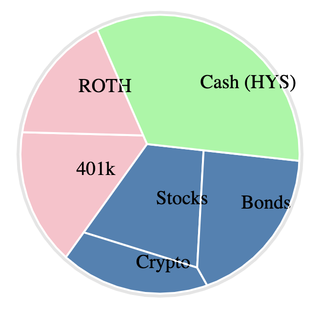

# Portfolio Visualizer Generator R Script

R script to generate portfolio visualization chart

> source: https://stackoverflow.com/questions/73641901/hierarchical-plot-with-bubbles-in-r



```r
library(voronoiTreemap)

vor <- data.frame(h1 = 'World', 
                  h2 = c(
                         'Retirement', 'Retirement',
                         'Investments', 'Investments', 'Investments',
                         'Cash'
                      ),
                  h3 = c(
                         "401k", "ROTH",
                         "Stocks", "Crypto", "Bonds",
                         "Cash (HYS)"
                      ),
                  color = rep(c(
                                "pink",
                                "steelblue",
                                "#96f8A0"
                              ),
                              times = c(
                                        2,
                                        3,
                                        1
                                      )
                            ),
                  weight = c(
                              10000, 8000,
                              10000, 5000, 9999,
                              21100
                            ),
                  codes = c(
                            "401k", "ROTH",
                            "Stocks", "Crypto", "Bonds",
                            "Cash (HYS)"
                          )
                )

vt <- vt_input_from_df(vor)

vt_d3(
  vt_export_json(vt),
  color_border = "#FFF",
  size_border = "2px",
  color_circle = "#e5e5e5",
  size_circle = "8px",
#  label = FALSE
)
```

## Instructions

- Install R + RStudio: https://posit.co/download/rstudio-desktop/
- Copy/paste the script
- Install [`voronoiTreemap`](https://github.com/uRosConf/voronoiTreemap) package
- Hit `cmd + Enter` to run the script
